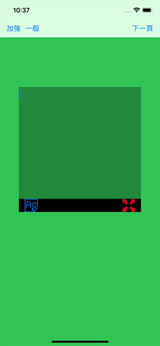

# WWLog
[](https://developer.apple.com/swift/) [](https://developer.apple.com/swift/) [](https://developer.apple.com/swift/) [](https://developer.apple.com/swift/)

This is a good helper for iOS engineer Debug.
這是一個iOS工程師Debug的好幫手。



### [Installation with Swift Package Manager](https://medium.com/彼得潘的-swift-ios-app-開發問題解答集/使用-spm-安裝第三方套件-xcode-11-新功能-2c4ffcf85b4b)
```swift
dependencies: [
    .package(url: "https://github.com/William-Weng/WWLog.git", .upToNextMajor(from: "1.0.0"))
]
```

### Example
```swift
import UIKit
import WWLog

final class ViewController: UIViewController {

    override func viewDidLoad() {
        super.viewDidLoad()
        _ = WWLog.shared
    }
    
    @IBAction func generalLog(_ sender: UIBarButtonItem) {
        WWLog.shared.log("高手專用")
    }
    
    @IBAction func detailLog(_ sender: UIBarButtonItem) {
        WWLog.shared.log("高高手專用", level: .detail)
    }
}
```
